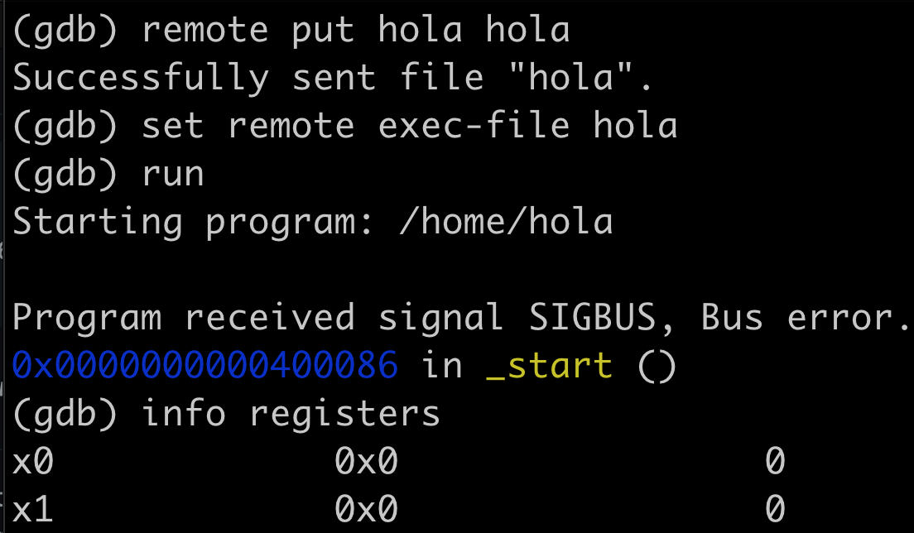
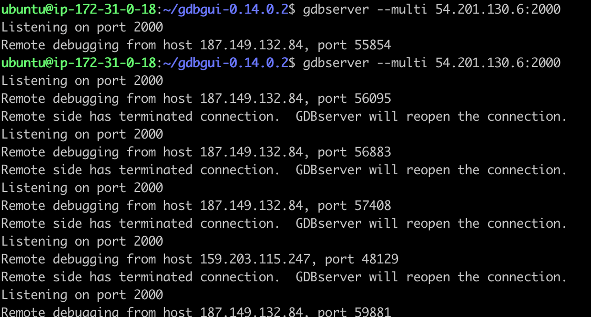

# GDB Debugger

GDB (Gnu Project Debugger) es una herramienta que permite entre otras cosas, correr el programa con la posibilidad de detenerlo cuando se cumple cierta condición, avanzar paso a paso, analizar que ha pasado cuando un programa se detiene o cambiar algunas cosas del programa como el valor de las variables.

GDB es una herramienta muy poderosa que nos ayudará a encontrar esos errores difíciles, por ejemplo cuando los punteros no apuntan a donde estamos pensando. 


````bash
DOCKERCLIENTE /home# gdb -q hola
Reading symbols from hola...
(No debugging symbols found in hola)
(gdb) target extended-remote 54.201.130.6:2000
Remote debugging using 54.201.130.6:2000
(gdb) 
(gdb) remote put hola holaremote
(gdb) set remote exec-file holaremote
(gdb) 
````

# Screenshoot Host




# GBD Servidor


Usando el programa gdbserver

gdbserver es un programa de control para sistemas similares a Unix, que le permite conectar su programa con un GDB remoto a través del control remoto de destino, pero sin vincular el stub de depuración habitual. GDB y gdbserver se comunican a través de una línea serial o una conexión TCP y UDP, usando el protocolo serial remoto estándar GDB.

gdbserver no es un reemplazo completo para los stubs de depuración, porque requiere esencialmente las mismas facilidades del sistema operativo que GDB. De hecho, un sistema que puede ejecutar gdbserver para conectarse a un GDB remoto también podría ejecutar GDB localmente. gdbserver a veces es útil, sin embargo, porque es un programa mucho más pequeño que el propio GDB. También es más fácil de migrar que todo GDB, por lo que es posible que pueda comenzar más rápidamente en un nuevo sistema usando gdbserver. Finalmente, si desarrolla código para sistemas en tiempo real, puede encontrar que las compensaciones involucradas en la operación en tiempo real hacen que sea más conveniente realizar la mayor cantidad de trabajo de desarrollo posible en otro sistema, por ejemplo mediante compilación cruzada. 

## COMO FUNCIONA

La depuración de GDBRemote es el proceso de depurar un programa que se ejecuta en un sistema diferente (llamado destino) desde un sistema diferente (llamado host).

Para iniciar la depuración remota, un depurador que se ejecuta en la máquina host se conecta a un programa que se ejecuta en el destino a través de la red.

El depurador en el host puede controlar la ejecución del programa en el sistema remoto y recuperar información sobre su estado.

La depuración remota suele ser útil en el caso de aplicaciones integradas donde los recursos son limitados.

En este tutorial, veremos cómo podemos depurar programas que se ejecutan en un sistema diferente usando GDB Server.

__Necesitamos las siguientes dos utilidades para realizar una depuración remota:__

- gdbserver: ejecute esto en su sistema de destino
- GDB: ejecute esto en su sistema host para conectarse a su sistema de destino
- GDB y gdbserver se comunican a través de una línea serial o una red, usando el protocolo serial remoto estándar gdb.
- GDB envia, recupera o borrara archivos que se transfieren entre los 2 equipos "get, put, delete" en linea de comandos.


## Instalación gbdserver en remoto

La máquina de destino (raspberrypi, Amazon Graviton CPU, etc) es la que está ejecutando el programa que debe depurar. Necesita tener el ejecutable "gdbserver" en la máquina de destino.

## SERVER
````
sudo apt-get install gdbserver

$ gdbserver --multi 54.201.130.6:2000
 
````


## 'attach', ‘continue’ o ‘detach’ 
Ahora puede "continuar" o "desconectar" el programa de la depuración. Aún así, gdbserver no se cerrará en la máquina de destino, por lo que puede cambiar el "archivo exec remoto" en cualquier momento y depurar un conjunto de programas diferente. El 'attach' es para asociar a un numero de proceso PID para depurarlo puede consulta la bibliografía.

## Screenshoot Remoto


## Advertencia: 
NOTA: tambien puede ser "localhost:2000" de correrlo en localmente sus practicas.
__gdbserver no tiene ninguna seguridad incorporada. No ejecute gdbserver conectado a ninguna red pública; una conexión GDB a gdbserver proporciona acceso al sistema de destino con los mismos privilegios que el usuario que ejecuta gdbserver.__ Por tal es reservado para practicas académicas y el servicio se suspende al no usarse.


# Salir de GDB
Para terminar la ejecución de GDB simplemente invocamos el comando quit o su forma abreviada q.

__Bibliografía__
https://clouds.eos.ubc.ca/~phil/docs/gdb/onlinedocs/gdb.html#SEC175
https://www.tutorialspoint.com/unix_commands/gdbserver.htm
https://www.thegeekstuff.com/2014/04/gdbserver-example/
https://www.thegeekstuff.com/2010/03/debug-c-program-using-gdb/
